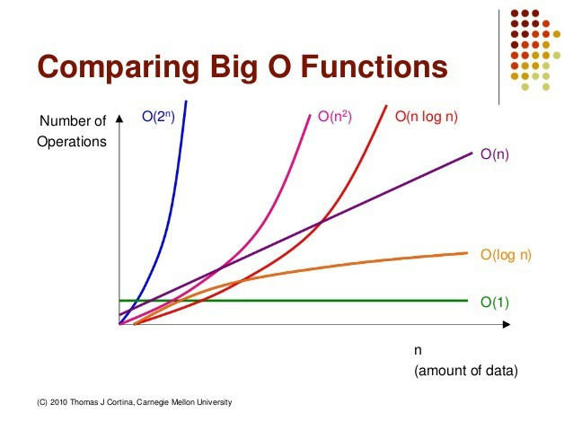

# IoT-algorithm-2025
IoT 개발자 자료구조와 알고리즘(코딩테스트) 리포지토리 2025

## 1일차

### 자료구조
- 데이터를 구성하고 효율적으로 관리하는 형태
#### 자료구조 종류
- 단순 자료구조
    - 정수, 실수, 문자, 문자열
- 선형 자료구조
    - 배열, 리스트, 스택, 큐
- 비선형 자료구조
    - 트리, 그래프
- 파일 자료구조
    - 순차 파일, 색인 파일, 직접 파일

### 알고리즘
- 문제를 해결하는 방법, 순서

#### 알고리즘 성능
- 빅오 표기법
    - $O(1)$ :데이터 수에 관계없이 항상 일정한 시간이 걸리는 것
    - $O(logn)$ : 단순 for문인데 전체 중 일부만 처리하는 것 
    - $O(n)$ : 단순 for문
    - $O(n\,logn)$ : 이중 for문인데 안쪽 for문이 전체 중 일부만 처리
    - $O(n^2)$ : 이중 for문
    - $O(n^3)$ : 삼중 for문
    - $O(2^n)$ : 팩토리얼 등등...

### 리스트 복습
- 1차원, 2차원
    - 리스트 생성, 인덱싱, **슬라이싱**, 함수..
    - 2차원 리스트 개념(행, 열, 생성)

## 2일차
- 기초 문법
    - 리스트 컴프리헨션 복습: [[노트북]](./day02/ds01_list_again.ipynb)

- 자료구조
    - 선형 리스트 [[노트북]](./day02/ds02_linear_list.ipynb)
    - 연결 리스트 [[노트북]](./day02/ds04_linked_list.ipynb)

## 3일차
- 자료구조
    - 연결리스트
        - 연결 리스트: [파이썬](./day03/ds01_linked_list.py)
        - 파이썬 list(): 연결리스트와 유사
        - 연결 리스트 응용예제1: [파이썬](./day03/ds01_linked_list_practice.py)
        - 원형 연결 리스트 - 시작노드 변경 시 오버헤드 없음
        - 이중 연결 리스트 - 앞에서 검색, 뒤에서 검색 용이
        - 연결리스트 사용 예 - 가상 메모리 관리, 윈도우 이벤트 관리 ...

    - 스택: [[노트북]](./day03/ds02_stack.ipynb)
        - 개념, 노트북 참조
        - 알고리즘 DFS(깊이우선탐색)시 사용
        - 구현 [파이썬](./day03/ds03_stack.py)
    - 큐: [[노트북]](./day03/ds04_queue.ipynb)
        - 개념, 노트북 참조
        - 알고리즘 BFS(넓이우선탐색)시 사용

## 4일차
- 자료구조/알고리즘
    - 큐
        - 큐 구현 [파이썬](./day04/ds01_queue.py)
        - 원형 큐 구현 [파이썬](./day04/ds02_circular_queue.py)
    - 이진트리: [[노트북]](./day04/ds03_binary_tree.ipynb)
        - 컴퓨터 시스템 등 많은 분야에서 사용
        - 이진트리 검색
        - 이진트리 구현: [노트북](./day04/ds04_binary_tree.py)
    
## 5일차
- 자료구조/알고리즘
    - 그래프: [[노트북]](./day05/ds01_graph.ipynb)
        - 깊이우선탐색: [파이썬](./day05/da01_dfs.py)
        - 최소비용 신장트리: [[파이썬]](./day05/da02_min_cost_spanningtree.py)
    
    - 재귀호출: [[노트북]](./day05/da03_recursive_call.ipynb)

## 6일차
- 자료구조/알고리즘
    - 재귀호출
        - 재귀호출 연습 [[노트북]](./day06/da01_recursive_practice.ipynb)
        - 프랙탈 연습

https://github.com/user-attachments/assets/01525430-0cdf-4aba-b965-27be144d5d91

- 자료구조/알고리즘
    - 정렬: [[노트북]](./day06/da04_sort.ipynb)

## 7일차
- 자료구조/알고리즘
    - 정렬
        - 퀵 정렬
        - 정렬 알고리즘 응용

    - 동적 계획법

## 8일차
- 자료구조/알고리즘
    - 검색: [[노트북]](./day08/da01_search.ipynb)
        - 검색 구현1 : [파이썬](./day08/da02.binary_search_practice01.py)
        - 순차검색, 이진검색 성능 비교 : [파이썬](./day08/da02.binary_search_practice02.py)
    - 코딩테스트
